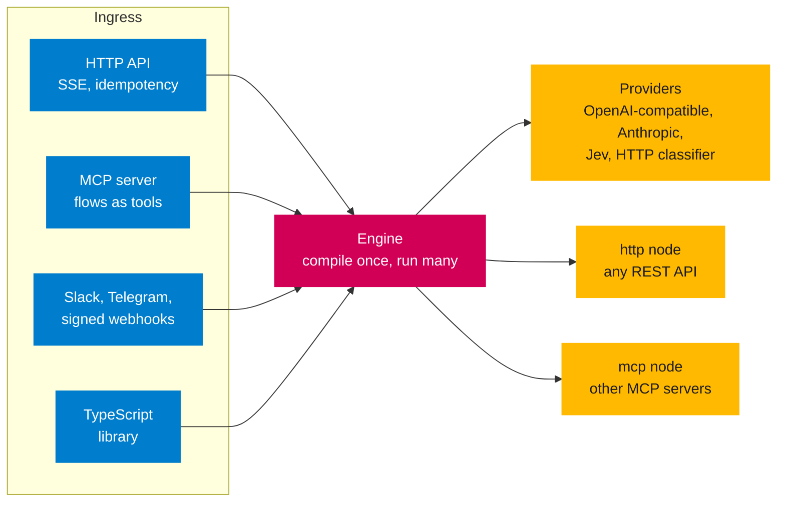
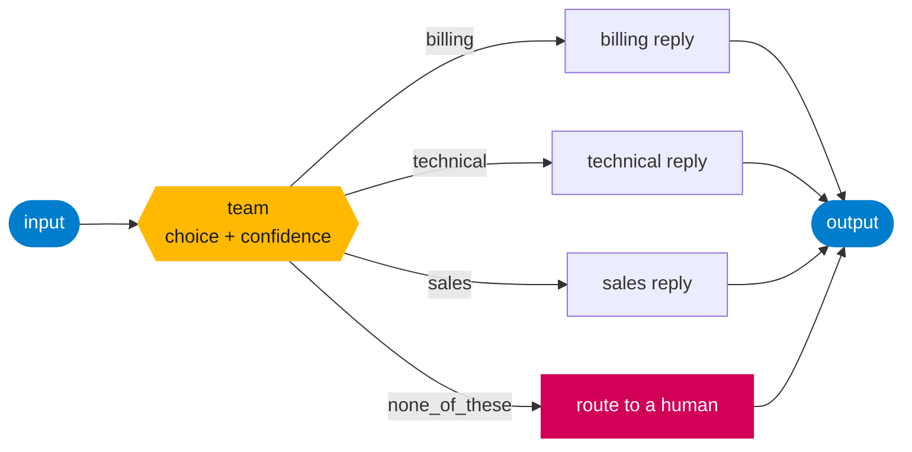

<p align="center">
  
</p>

# Milford

[](https://github.com/milfordai/milford/actions/workflows/ci.yml)
[](https://www.npmjs.com/package/@milfordai/core)
[](https://github.com/milfordai/milford/releases)
[](https://milford.mintlify.site)
[](LICENSE)

## Intelligent workflows as code: typed decisions, model calls and HTTP calls in a graph

Milford is a headless workflow engine. You describe a flow as plain JSON: small steps such as a typed decision, a model call, a template or an HTTP call, wired in a graph. Milford runs it behind an HTTP API, an MCP server, chat channels or as a TypeScript library.

It is not an agent framework. A flow is a fixed graph with no agent loop, so you can read it, version it in git and test it. Models answer narrow, typed questions, and your graph decides what happens next.

[**Documentation**](https://milford.mintlify.site) · [Quick Start](#quick-start) · [How it works](#how-it-works) · [Examples](#examples) · [Releases](https://github.com/milfordai/milford/releases)

## Quick Start

**Go from nothing to a running flow in a minute. No API key needed.** You need Node.js 22 or later.

**Step 1:** Create a config and a flow

Save this as `milford.config.yaml`:

```yaml
flows:
  - { file: ./flows/hello.yaml }
server:
  port: 8080
  auth: { tokens: ["${MILFORD_TOKEN}"] }
```

Save this as `flows/hello.yaml`:

```yaml
id: hello
nodes:
  - { id: in, type: input }
  - { id: greet, type: prompt, config: { template: "Hello {{input.name}}!" } }
  - { id: out, type: output }
edges:
  - { from: in, to: greet }
  - { from: greet, to: out }
```

**Step 2:** Start Milford

```bash
MILFORD_TOKEN=change-me npx @milfordai/server milford.config.yaml
# or with pnpm
MILFORD_TOKEN=change-me pnpm dlx @milfordai/server milford.config.yaml
```

To check a config and its flows without starting the server (for example in CI), run `npx @milfordai/server validate milford.config.yaml`. It exits non-zero on any error.

**Step 3:** Run a flow

```bash
curl -s localhost:8080/v1/flows/hello/run \
  -H "authorization: Bearer change-me" \
  -d '{"input": {"name": "Ann"}}'
```

The response holds the result of every node and the flow `output`, here `"Hello Ann!"`.

**Step 4:** Add a model

A `decision` node asks a provider a typed question and returns a value you can branch on. Add a provider to `milford.config.yaml`:

```yaml
providers:
  - { id: main-llm, type: anthropic, apiKey: "${ANTHROPIC_API_KEY}", model: claude-sonnet-5 }
```

Then use it in a flow. Edges with `when` route on the answer, and a low-confidence answer becomes `none_of_these`:

```json
{ "id": "team", "type": "decision", "config": {
    "provider": "main-llm", "kind": "choice",
    "prompt": "Which team should handle this message?",
    "options": ["billing", "technical", "sales"],
    "state": "{{input.text}}", "minConfidence": 0.6 } }
```

```json
{ "from": "team", "to": "billing-reply", "when": { "path": "data.choice", "op": "eq", "value": "billing" } }
```

The complete flow is `flows/triage.yaml` in the examples. Switching the provider to an OpenAI-compatible server or a local classifier is a config change, and the flow stays the same.

**That's it!** Your flow runs behind an authenticated API with streaming, idempotent retries and run limits.

<details>
<summary>Prefer Docker, or want to run from a clone?</summary>

```bash
git clone https://github.com/milfordai/milford && cd milford
docker build -t milford .
docker run -p 8080:8080 -e MILFORD_TOKEN=change-me -v "$PWD/examples/quickstart:/config:ro" milford
```

Without Docker, use Node 22 and pnpm:

```bash
pnpm install && pnpm build
MILFORD_TOKEN=change-me node packages/server/dist/cli.js examples/quickstart/milford.config.yaml
```

</details>


---

## Install

```bash
npm install @milfordai/core @milfordai/providers      # the library
npm install --global @milfordai/server @milfordai/mcp # the milford-server and milford-mcp commands
```

With pnpm, use `pnpm add` and `pnpm add --global`. The packages need Node.js 22 or later and are released together, so keep every `@milfordai/*` dependency on the same version.

| Package | What it is |
| --- | --- |
| [`@milfordai/server`](https://www.npmjs.com/package/@milfordai/server) | The HTTP server and the `milford-server` command. Includes Slack, Telegram and webhook channels. |
| [`@milfordai/mcp`](https://www.npmjs.com/package/@milfordai/mcp) | The MCP server, the `milford-mcp` command and the `mcp` node. |
| [`@milfordai/core`](https://www.npmjs.com/package/@milfordai/core) | The engine: flows, nodes and the provider port. No I/O. |
| [`@milfordai/providers`](https://www.npmjs.com/package/@milfordai/providers) | OpenAI-compatible, Anthropic, Jev and HTTP provider adapters. |
| [`@milfordai/config`](https://www.npmjs.com/package/@milfordai/config) | The config loader and the JSON Schema of the config file. |
| [`@milfordai/channels`](https://www.npmjs.com/package/@milfordai/channels) | The Slack, Telegram and webhook adapters. |

See [installation](https://milford.mintlify.site/installation) for global installs, Docker and editor completion.

---

## How it works

Every way of starting a run goes through the same engine. Flows are compiled once at startup, then each run walks the precomputed levels.



A flow is a graph. Nodes in the same level run in parallel, `when` conditions on edges skip untaken branches, and a failed branch does not stop the others. This is the triage flow from the Quick Start:



Every run returns a trace. This is the `category` decision of the enterprise example, with a stand-in provider:

```json
{
  "status": "done",
  "result": {
    "success": true,
    "output": "billing",
    "data": {
      "kind": "choice",
      "question": "Which category does this message belong to?",
      "options": ["billing", "technical", "sales", "none_of_these"],
      "choice": "billing",
      "confidence": 0.93,
      "gated": false,
      "provider": "classifier"
    }
  }
}
```

The answer, the options that were offered, the confidence and the provider are all in the result, so a UI or an audit log can show why a branch was taken.

---

## Key Features

### Flows

- **[Plain JSON graphs](https://milford.mintlify.site/concepts/flows)** - No UI types in the model. Write JSON by hand or build it with the TypeScript `flow()` builder.
- **[Parallel execution](https://milford.mintlify.site/concepts/flows)** - Nodes in a level run concurrently. Failed branches are isolated and reported in the result.
- **[Branching](https://milford.mintlify.site/concepts/flows)** - Route on any field of a node result, with `join: "all"` when a node needs every input.
- **[Retries, timeouts and caching](https://milford.mintlify.site/concepts/flows)** - Per node, with abort signals that reach every network call.
- **[Templates](https://milford.mintlify.site/concepts/flows)** - `{{input.field}}` and `{{node.data.field}}` placeholders. An unknown variable fails the node instead of rendering an empty string.

### Decisions and models

- **[Typed decisions](https://milford.mintlify.site/concepts/decisions)** - `choice`, `score` and `noul` answers instead of parsed free text, with confidence gating and a `none_of_these` option.
- **[Providers](https://milford.mintlify.site/providers/overview)** - OpenAI and any OpenAI-compatible server, Anthropic, Jev, and a generic HTTP endpoint for your own classifier.
- **[Fallback, circuit breaker and rate limit](https://milford.mintlify.site/providers/overview)** - Prefer a local provider and fall back to a cloud one, or the reverse.
- **[Fan-out](https://milford.mintlify.site/concepts/decisions)** - Decisions in the same level run together, and providers that support batching receive them as one request.

### Interfaces

- **[HTTP API](https://milford.mintlify.site/reference/http-api)** - Run flows with server-sent events, `Idempotency-Key` retries, bearer auth and an [OpenAPI 3.1 spec](packages/server/openapi.yaml).
- **[MCP server](https://milford.mintlify.site/guides/mcp)** - Expose chosen flows as tools to external LLMs over stdio or Streamable HTTP. Nothing is exposed by default.
- **[MCP client](https://milford.mintlify.site/guides/mcp)** - The `mcp` node calls tools on other MCP servers, and a decision can choose the tool from an allow list.
- **[Channels](https://milford.mintlify.site/guides/channels)** - Slack (Socket Mode), Telegram and signed webhooks. Access is deny by default.

### Deploy and operate

- **[Config as code](https://milford.mintlify.site/reference/config)** - One YAML file with `${ENV}` interpolation and a generated JSON Schema for editor completion.
- **[Docker](https://milford.mintlify.site/reference/deployment)** - Images for `linux/amd64` and `linux/arm64`, one for the HTTP server and one for the MCP server. No database.
- **[Run limits](https://milford.mintlify.site/reference/config)** - A shared timeout and concurrency cap, JSON logs and a graceful shutdown.
- **[Vendor neutral](AGENTS.md)** - The core has no I/O and no vendor code. CI fails if `typesafe` or `jev` appears in it.

---

## Built-in Nodes and Providers

| Node | What it does |
| --- | --- |
| `input` | Exposes the run input. |
| `prompt` | Renders a template from the input and upstream results. |
| `llm` | One chat call through a provider. No loop, no tools. Presets: summarize, classify, extract, rewrite, translate. |
| `decision` | A typed `choice`, `score` or `noul` answer, with `minConfidence` gating and dynamic options. |
| `http` | A templated HTTP call. A non-2xx response fails the node. |
| `mcp` | One tool call on another MCP server. |
| `output` | Marks the flow result. |

Add your own node with one `registerNode` call: [built-in nodes reference](https://milford.mintlify.site/nodes/reference).

| Provider | Capabilities | Notes |
| --- | --- | --- |
| `openai` | chat, decide | Any OpenAI-compatible server through `baseUrl`, such as Groq or a local server. |
| `anthropic` | chat, decide | Decisions use forced tool use with a JSON schema. |
| `typesafe` | decide | Jev. Probabilities and confidence, with batching. |
| `http` | decide, chat | Your own classifier endpoint, with a request template and JSONPath mapping. |

LLM-backed decisions report the model's own confidence estimate, not a calibrated probability. See [providers](https://milford.mintlify.site/providers/overview).

---

## Getting Started Options

### 1. HTTP server

**Best for:** any language or framework calling flows over REST.

```bash
npx @milfordai/server milford.config.yaml
```

An [OpenAPI 3.1 spec](packages/server/openapi.yaml) describes the API, so you can generate a client for Java, .NET, Python or Go.

### 2. MCP server

**Best for:** LLM clients such as Claude Desktop, Claude Code or your own agents that should call your flows as tools.

```yaml
mcp:
  expose: [triage]            # nothing is exposed unless listed
  transport: http
  auth: { tokens: ["${MILFORD_MCP_TOKEN}"] }
```

```bash
npx @milfordai/mcp milford.config.yaml
claude mcp add --transport http milford http://localhost:8090/mcp \
  --header "Authorization: Bearer $MILFORD_MCP_TOKEN"
```

Give a flow a `description` and an `input` JSON Schema, and clients see them as the tool description and arguments. See the [MCP guide](https://milford.mintlify.site/guides/mcp).

### 3. TypeScript library

**Best for:** embedding the engine in a TypeScript app.

```ts
import { createEngine, defaultRegistry, flow } from "@milfordai/core";
import { registerProviders } from "@milfordai/providers";

const engine = createEngine({
  registry: registerProviders(defaultRegistry()),
  providers: [{ id: "main", type: "anthropic", apiKey: process.env.ANTHROPIC_API_KEY!, model: "claude-sonnet-5" }],
  flows: [
    flow("summarize")
      .node("sum", "llm", { provider: "main", preset: "summarize", prompt: "{{input.text}}" })
      .node("out", "output")
      .edge("sum", "out")
      .build(),
  ],
});
if (!engine.ok) throw new Error(engine.error);

const result = await engine.value.run("summarize", { text: "..." });
```

`createEngine` and `run` return results instead of throwing. Check `ok` before you read `value`.

### Queue-driven services

A service that reads from a queue such as IBM MQ, RabbitMQ or Kafka keeps the queue, the transactions and its own state, and calls Milford over HTTP for the decisions. Send the message id as an `Idempotency-Key` so a redelivered message does not run the flow, or pay for the model calls, twice.

```text
queue ──> your service ──POST /v1/flows/classify-message/run──> Milford ──> model or classifier
              │  (transactions, acknowledgement,               (stateless)
              │   history lookup, storage)
              └──> writes the result to its own database
```

See [enterprise integration](https://milford.mintlify.site/guides/enterprise-integration).

---

## Configuration

One YAML file configures providers, flows, channels, MCP and limits. `${ENV}` values are filled from the environment, so the file holds no secrets.

```yaml
providers:
  - id: main-llm
    type: anthropic
    apiKey: "${ANTHROPIC_API_KEY}"
    model: claude-sonnet-5
    fallback: [local]                               # try this provider if main-llm fails
    circuitBreaker: { failures: 5, resetMs: 30000 } # fail fast so the fallback takes over
    rateLimit: { perSecond: 10 }
  - id: local
    type: openai
    baseUrl: http://localhost:11434/v1
    model: llama3.2
flows:
  - { file: ./flows/triage.yaml }
channels:
  - id: support-slack
    type: slack
    flow: triage
    appToken: "${SLACK_APP_TOKEN}"
    botToken: "${SLACK_BOT_TOKEN}"
    allow: ["U024BE7LH"]                            # required: channels are deny by default
mcpServers:
  - { id: crm, url: "https://crm.example.com/mcp", headers: { authorization: "Bearer ${CRM_TOKEN}" } }
mcp:
  expose: [triage]
  transport: http
  auth: { tokens: ["${MILFORD_MCP_TOKEN}"] }
server:
  port: 8080
  auth: { tokens: ["${MILFORD_TOKEN}"] }
run: { timeoutMs: 30000, maxConcurrentRuns: 32 }
```

The server checks everything at startup: unknown providers, providers that cannot do what a node needs, bad node config and cycles fail the boot instead of failing a request. See the [configuration reference](https://milford.mintlify.site/reference/config).

---

## Repository Structure

```text
Milford/
├── packages/
│   ├── core/            # Flow compiler, executor, nodes, provider port. No I/O
│   ├── config/          # YAML config loader and JSON Schema, shared by both servers
│   ├── providers/       # OpenAI-compatible, Anthropic, Jev and HTTP adapters
│   ├── server/          # HTTP server (Hono): API, SSE, idempotency, webhooks
│   ├── channels/        # Slack, Telegram and webhook adapters
│   └── mcp/             # MCP server and the mcp node
├── examples/quickstart/ # The config from the Quick Start
├── Dockerfile           # Targets: server (default) and mcp
└── docker-compose.yml
```

---

## Examples

[`examples/quickstart`](examples/quickstart) is in this repository. The larger examples are in a separate repository that is not public yet.

| Example | What it shows |
| --- | --- |
| [`examples/quickstart`](examples/quickstart) | The config from the Quick Start. Runs without an API key. Lives in this repository. |
| `flows` | One flow per idea: templates, a summarizing model call, decision routing and a webhook call. |
| `home-automation` | A free-text command turned into device actions by a fan-out of small decisions, with a fake device server so it runs without hardware. [Guide](https://milford.mintlify.site/guides/home-automation). |
| `enterprise` | A service that reads messages from a queue and asks Milford to sort each one into caller-supplied categories and spot repeats. One env file per environment. |

---

## Documentation

The full documentation is at **[milford.mintlify.site](https://milford.mintlify.site)**. Every page can be copied as Markdown or opened in an AI assistant, and there is an [`llms.txt`](https://milford.mintlify.site/llms.txt).

| Start here | Concepts | Guides | Reference |
| --- | --- | --- | --- |
| [Introduction](https://milford.mintlify.site) | [Flows](https://milford.mintlify.site/concepts/flows) | [MCP](https://milford.mintlify.site/guides/mcp) | [Configuration](https://milford.mintlify.site/reference/config) |
| [Quickstart](https://milford.mintlify.site/quickstart) | [Decisions](https://milford.mintlify.site/concepts/decisions) | [Channels](https://milford.mintlify.site/guides/channels) | [HTTP API](https://milford.mintlify.site/reference/http-api) |
| [Built-in nodes](https://milford.mintlify.site/nodes/reference) | [Providers](https://milford.mintlify.site/providers/overview) | [Enterprise integration](https://milford.mintlify.site/guides/enterprise-integration) | [Deployment](https://milford.mintlify.site/reference/deployment) |
| | | [Home automation](https://milford.mintlify.site/guides/home-automation) | [OpenAPI spec](packages/server/openapi.yaml) |

---

## Status

Milford is at v0.0.3. The config format can still change. The Slack and Telegram adapters and the provider adapters are tested against mocked network calls, not live services, so try them with a test workspace and test keys first.

---

## Need Help?

- Open an [issue](https://github.com/milfordai/milford/issues) for a bug or a question.
- Read the [documentation](https://milford.mintlify.site), or ask your AI assistant with the page menu on any docs page.

## Contributing

```bash
pnpm install
pnpm build        # builds every package with Turborepo
pnpm typecheck
pnpm test
```

Work happens on `feature/<name>` branches from `dev`, merged back with a pull request, and releases are tagged from `main`. The documentation site is kept in a separate repository. If your change is visible to users (a node, a provider, a config key, an endpoint or a CLI flag), describe the docs change in your pull request and a maintainer updates the site. See [AGENTS.md](AGENTS.md) for the architecture rules and the git flow.

## License

Apache-2.0. See [LICENSE](LICENSE).
